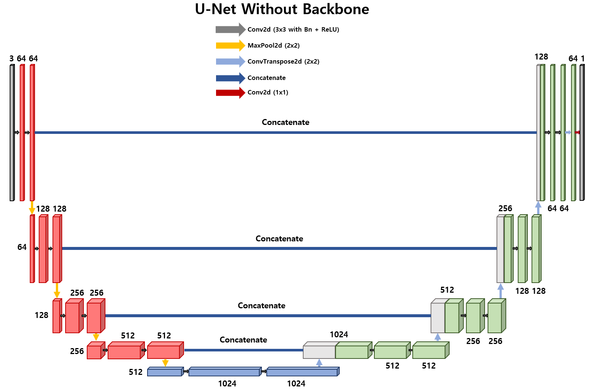

## UNet with ResNet Backbone

This repository contains an implementation of a UNet model with a ResNet backbone using PyTorch. The model leverages pretrained weights from ResNet to enhance feature extraction in the encoder part of the UNet architecture. Additionally, an ensemble model is provided to combine multiple UNet models for improved performance.


## Introduction

UNet is a popular convolutional neural network architecture for biomedical image segmentation. It consists of a contracting path to capture context and a symmetric expanding path that enables precise localization.


## U-Net Architecture



## Installation

To get started, clone the repository and install the required dependencies:

```bash
git clone https://github.com/gyb357/UNet-Segmentation.git
pip install -r requirements.txt
```


## File Structure
The repository is structured as follows:
```
.
├── config/
│   └── config.yaml       # Configuration files
├── csv/
│   └── train_logg.csv    # Train logg csv files
├── dataset/
│   ├── image/            # Directory for train image dataset
│   ├── mask/             # Directory for train mask dataset
│   └── test/             # Directory for test image dataset
├── model/
│   ├── checkpoint/       # Directory for checkpoint models
│   └── pretrained/       # Directory for storing pretrained models
├── runs/                 # Directory for tensorboard
│
├── dataset.py            # Script for dataset preparation
├── main.py               # Main script to run the training and evaluation
├── loss.py               # Script to calculate loss (mIoU, Dice)
├── plot.py               # Show train_logg.csv with matplotlib
├── requirement.txt       # Required dependencies
├── resnet.py             # ResNet model definition
├── test.py               # Script for testing/evaluation
├── train.py              # Script for training the model
├── unet.py               # UNet model definition
└── utils.py              # Utility functions
```


## How to use it

1. Check the config.yaml and adjust the parameters and file addresses of the model.
2. Place a dataset or prelearning weight in the specified file.
3. Run main.py to learn and test the model.
4. In cmd, enter the "tensorboard --logdir= your tensorboard log dir" and access the web browser at "localhost:6006" to check the tensorboard.
   (or, run plot.py.)


## Pretrained Weights
Download the Imagenet1K pretrained model and put it in the model/pretrained/.
Download link
    https://pytorch.org/vision/stable/_modules/torchvision/models/resnet.html
    
    resnet18 v1: https://download.pytorch.org/models/resnet18-f37072fd.pth
    resnet34 v1: https://download.pytorch.org/models/resnet34-b627a593.pth
    resnet50 v2: https://download.pytorch.org/models/resnet50-11ad3fa6.pth
    resnet101 v2: https://download.pytorch.org/models/resnet101-cd907fc2.pth
    resnet152 v2: https://download.pytorch.org/models/resnet152-f82ba261.pth


The train_logg.csv file lets you see how the learning progresses. Also, you can use the tensorboard.

