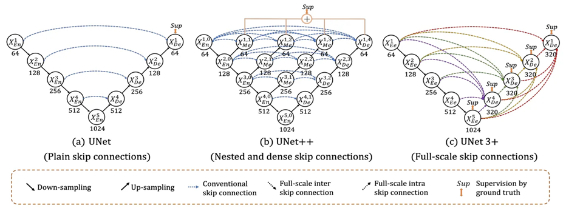

# Table of Contents

1. [Introduction](#Introduction)
     * UNet Implementations with ResNet Backbone
     * Purpose of the Project
     
2. [Architecture Overview](#Architecture-Overview)
     * UNet
     * UNet++
     * UNet3+

3. [Model Comparison](#Model-Comparison)

4. [Getting Started](#Getting-Started)
     * Check the Running Environment
     * Installation and Dependencies
     * Downloading Pre-Trained ResNet Weights
     * 
5. [Project Structure](#Project-Structure)


*****


# 📑Introduction

## UNet Implementations with ResNet Backbone
This repository implements multiple UNet-based architectures with ResNet backbones using PyTorch. The models leverage pretrained weights from ResNet to enhance feature extraction in the encoder parts of these architectures. The implementation includes UNet, UNet++, and UNet3+, all of which support ResNet backbones for improved performance on biomedical image segmentation tasks.

## Purpose of the Project
This project focuses on implementing and comparing various UNet architectures, integrating them with powerful ResNet backbones to create high-performance segmentation models. The implementation supports seamless switching between different UNet variants to find the optimal architecture for specific segmentation tasks.


*****


# 🔍Architecture Overview



## UNet
The classic UNet architecture features a symmetric encoder-decoder structure with skip connections, allowing it to capture contextual information while preserving spatial details. This design makes UNet effective for general biomedical image segmentation tasks. The encoder progressively reduces spatial dimensions while extracting high-level features, and the decoder restores the original resolution using upsampling layers. Skip connections directly transfer fine-grained spatial information from the encoder to the decoder, helping to recover precise segmentation boundaries.

## UNet++
UNet++ redesigns the skip connections with a nested dense structure, effectively bridging the semantic gap between encoder and decoder features. This design introduces convolutional layers within the skip pathways, progressively refining features before passing them to the decoder. Additionally, UNet++ enabling more effective gradient propagation and improving segmentation accuracy.

## UNet3+
UNet3+ takes a full-scale approach by introducing extensive skip connections that link each decoder stage with all encoder stages, rather than just the corresponding level. This multi-scale feature fusion integrates high-level semantic information with low-level spatial details at every decoder level, enhancing both fine-grained segmentation and global context awareness.

 > [!Note]
 > For more information, see the corresponding arxiv paper.
 > - [UNet arxiv paper](https://arxiv.org/abs/1505.04597)
 > - [UNet++ arxiv paper](https://arxiv.org/abs/1807.10165)
 > - [UNet3+ arxiv paper](https://arxiv.org/abs/2004.08790)


*****


# 📋Model Comparison

<div align="center">

## UNet

| Model Architecture | Backbone  | Number of Parameters |
|--------------------|-----------|----------------------|
| UNet              | -         | 31.04M              |
| ResUNet18         | ResNet18  | 20.78M              |
| ResUNet34         | ResNet34  | 30.89M              |
| ResUNet50         | ResNet50  | 40.90M              |
| ResUNet101        | ResNet101 | 59.89M              |
| ResUNet152        | ResNet152 | 75.54M              |

## ResNet

| Model Architecture | Layers | Parameters | ImageNet Accuracy (Top-1/Top-5) | Download Link |
|--------------------|--------|------------|---------------------------------|---------------|
| ResNet18         | 18     | 11.69M     | 69.76% / 89.08%                 | [resnet18-f37072fd.pth]("https://download.pytorch.org/models/resnet18-f37072fd.pth") |
| ResNet34         | 34     | 21.80M     | 73.31% / 91.42%                 | [resnet34-b627a593.pth]("https://download.pytorch.org/models/resnet34-b627a593.pth") |
| ResNet50         | 50     | 25.56M     | 80.86% / 95.43%                 | [resnet50-11ad3fa6.pth]("https://download.pytorch.org/models/resnet50-11ad3fa6.pth") |
| ResNet101        | 101    | 44.55M     | 81.89% / 95.78%                 | [resnet101-cd907fc2.pth]("https://download.pytorch.org/models/resnet101-cd907fc2.pth") |
| ResNet152        | 152    | 60.19M     | 82.28% / 96.00%                 | [resnet152-f82ba261.pth]("https://download.pytorch.org/models/resnet152-f82ba261.pth") |

</div>

 > [!Note]
 > Download the Imagenet1K pretrained model and put it in the model/pretrained/.
 > More information is available [here](https://pytorch.org/vision/stable/_modules/torchvision/models/resnet.html).


*****


# 🔨Getting Started

## 1. Check the Running Environment
Before proceeding, ensure that your system has a compatible GPU and CUDA installed. You can check this by running:
```bash
nvidia-smi
```

## 2. Installation and Dependencies
Clone the repository and install dependencies:

```bash
git clone https://github.com/gyb357/UNet-Segmentation
cd UNet-Segmentation
pip install -r requirements.txt
```

If your GPU is not recognized or CUDA is not properly set up, you may need to install the appropriate version of PyTorch. You can find the correct `.whl` file from the official [PyTorch website](https://pytorch.org/get-started/previous-versions/).

For example, if you are using CUDA 12.1, install PyTorch with:

```bash
pip uninstall torch torchvision torchaudio
pip install torch torchvision torchaudio --index-url https://download.pytorch.org/whl/cu121
```

## 3. Downloading Pre-Trained ResNet Weights

## 4. 


*****


# 📁Project Structure

```bash
UNet-Segmentation
├── assets/           # Contains images and other assets for documentation
│   └── unet.png
├── config/           # Stores configuration files
│   └── config.yaml
├── dataset/          # Handles dataset-related operations
│   ├── image/        # Stores raw images for training
│   ├── label/        # Stores ground truth labels
│   ├── mask/         # Stores segmentation masks
│   └── dataset.py
├── model/            # Contains model architectures and utilities
│   ├── modules.py
│   ├── resnet.py
│   ├── unet.py
│   ├── unet2+.py
│   ├── unet3+.py
│   └── utils.py
├── train/            # Training-related scripts
│   ├── loss.py
│   └── train.py
├── __init__.py
├── main.py           # Main entry point for running experiments
├── README.md         # Project documentation (this file)
├── requirements.txt  # Dependencies required to run the project
├── setup.cfg
└── setup.py
```

