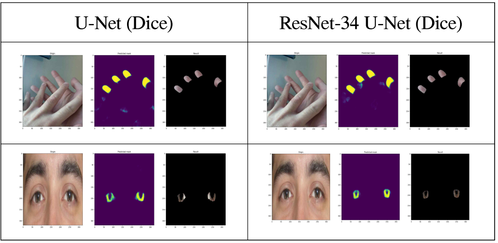
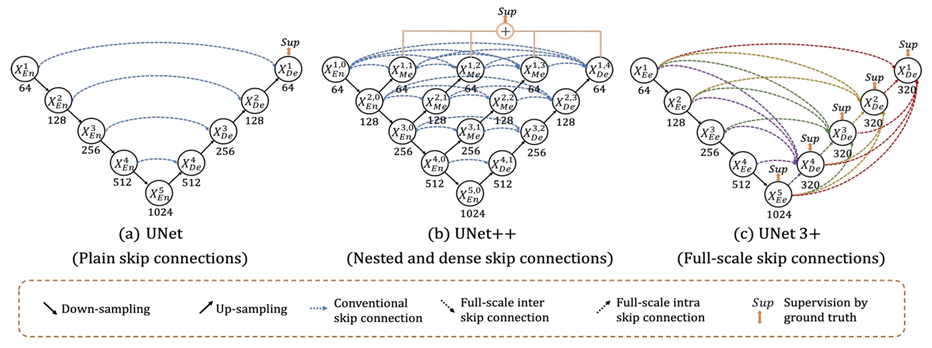

# Table of Contents

1. [Introduction](#Introduction)
2. [Architecture Overview](#Architecture-Overview)
3. [Model Comparison](#Model-Comparison)
4. [Getting Started](#Getting-Started)
     * Check the Running Environment
     * Installation and Dependencies
     * Downloading Pre-Trained ResNet Weights
     * Training the Model
5. [Project Structure](#Project-Structure)


*****


# 📑Introduction

## UNet Implementations with ResNet Backbone
This repository implements multiple UNet-based architectures with ResNet backbones using PyTorch. The models leverage pretrained weights from ResNet to enhance feature extraction in the encoder parts of these architectures. The implementation includes UNet, UNet++, and UNet3+, all of which support ResNet backbones for improved performance on biomedical image segmentation tasks.




*****


# 🔍Architecture Overview



The UNet architecture features a symmetric encoder-decoder structure with skip connections, allowing it to capture contextual information while preserving spatial details. This design makes UNet effective for general biomedical image segmentation tasks. The encoder progressively reduces spatial dimensions while extracting high-level features, and the decoder restores the original resolution using upsampling layers. Skip connections directly transfer fine-grained spatial information from the encoder to the decoder, helping to recover precise segmentation boundaries.

 > [!Note]
 > For more information, see the corresponding arxiv paper.
 > - [UNet arxiv paper](https://arxiv.org/abs/1505.04597)
 > - [UNet2+ arxiv paper](https://arxiv.org/abs/1807.10165)
 > - [UNet3+ arxiv paper](https://arxiv.org/abs/2004.08790)


*****


# 📋Model Comparison

<div align="center">

## UNet Parameters

|  Backbone  |  UNet  | UNet2+ | UNet3+ |
|------------|--------|--------|--------|
| -          | 31.04M | 20.62M | 20.13M |
| ResNet 18  | 20.78M | 12.86M | 12.30M |
| ResNet 34  | 30.89M | 22.97M | 22.40M |
| ResNet 50  | 40.90M | 25.51M | 25.16M |
| ResNet 101 | 59.89M | 44.50M | 44.15M |
| ResNet 152 | 75.54M | 60.15M | 59.79M |


## ResNet

| Model Architecture | Layers | Parameters | ImageNet Accuracy (Top-1/Top-5) | Download Link |
|--------------------|--------|------------|---------------------------------|---------------|
| ResNet18         |  18    |   11.69M   |         69.76% / 89.08%         | [resnet18-f37072fd.pth](https://download.pytorch.org/models/resnet18-f37072fd.pth) |
| ResNet34         |  34    |   21.80M   |         73.31% / 91.42%         | [resnet34-b627a593.pth](https://download.pytorch.org/models/resnet34-b627a593.pth) |
| ResNet50         |  50    |   25.56M   |         80.86% / 95.43%         | [resnet50-11ad3fa6.pth](https://download.pytorch.org/models/resnet50-11ad3fa6.pth) |
| ResNet101        |  101   |   44.55M   |         81.89% / 95.78%         | [resnet101-cd907fc2.pth](https://download.pytorch.org/models/resnet101-cd907fc2.pth) |
| ResNet152        |  152   |   60.19M   |         82.28% / 96.00%         | [resnet152-f82ba261.pth](https://download.pytorch.org/models/resnet152-f82ba261.pth) |

</div>

 > [!Note]
 > Download the Imagenet1K pretrained model and put it in the `./model/pretrained/.`
 > More information is available [here](https://pytorch.org/vision/stable/_modules/torchvision/models/resnet.html).


*****


# 🔨Getting Started

## 1. Check the Running Environment
Before proceeding, ensure that your system has a compatible GPU and CUDA installed. You can check this by running:
```bash
nvidia-smi
```

## 2. Installation and Dependencies
Clone the repository and install dependencies:

```bash
git clone https://github.com/gyb357/UNet-Segmentation
pip install -r requirements.txt
```

If your GPU is not recognized or CUDA is not properly set up, you may need to install the appropriate version of PyTorch.
[PyTorch website](https://pytorch.org/get-started/previous-versions/).

For example, if you are using CUDA 12.1, install PyTorch with:

```bash
pip uninstall torch torchvision
pip install torch torchvision --index-url https://download.pytorch.org/whl/cu121
```

## 3. Downloading Pre-Trained ResNet Weights
Check Model Comparison topic.

## 4. Training the Model
Modify the `./config/config.yaml` file before training.
To train the model, run `./main.py`.


 > [!IMPORTANT]
 > For training to work properly, the image dataset files and mask dataset files must have identical filenames. This ensures correct pairing between input images and their corresponding segmentation masks.
 >
 > Place your original images in `dataset/image/` and segmentation mask images in `dataset/mask/`. If your mask data is in text format (e.g., .txt files), place them in `dataset/label/` and configure the MaskImageGenerator accordingly.


*****


# 📁Project Structure

```bash
UNet-Segmentation
├── assets/           # Contains images and other assets for documentation
│   └── unet.png
├── best_model/       # The model with the highest accuracy in valid_dataset is stored here
├── checkpoint/       # Periodically, models are stored here
├── config/           # configuration files
│   └── config.yaml
├── dataset/          # Handles dataset-related operations
│   ├── image/        # Stores raw images for training
│   ├── label/        # Stores ground truth labels
│   ├── mask/         # Stores segmentation masks
│   └── dataset.py
├── final_model/      # This is where the final training model is stored
├── log               # A record of your learning progress
│   └── train.csv
├── model/            # Contains model architectures and utilities
│   ├── pretrained/   # Put pretrained resnet weights here
│   ├── modules.py
│   ├── resnet.py
│   └── unet.py
├── train/            # Training-related scripts
│   ├── loss.py
│   └── train.py
├── LICENSE
├── main.py           # Main entry point for running experiments
├── README.md
├── requirements.txt
└── utils.py
```

